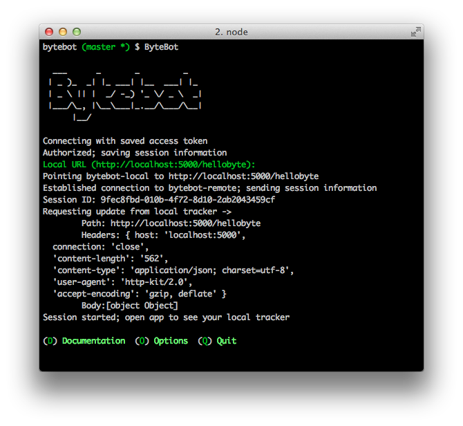

Bytebot
===

A simple command line utility to help you build Bytes.

Bytebot allows you to view and test a Byte from any URL (local or live) directly on your phone.

Check out the [Byte API Docs](https://github.com/onehq/byte-api) for more information on building a Byte.

If you have ANY questions hop into our IRC channel. We'll get back to you immediately.

IRC: **#byteapi** on chat.freenode.net, **[or connect in your browser](http://webchat.freenode.net/?randomnick=1&channels=%23byteapi&prompt=0&uio=Mj10cnVlJjQ9dHJ1ZSYxMT0yNDY15)**.

## Installation

1. `npm install -g bytebot`
2. `$ bytebot` from anywhere

If you're having problems, re-install [node.js](http://nodejs.org) and try again.
